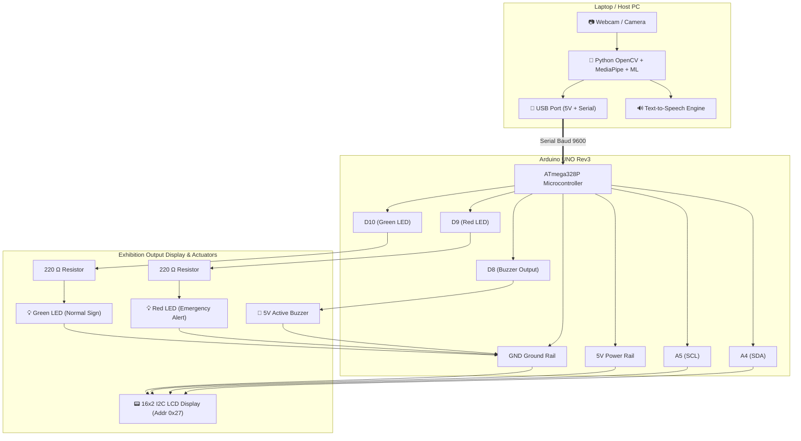

# Hardware Circuit Diagram & Pinout Connections

This document provides complete circuit schematics, pin mappings, Bill of Materials (BOM), and power requirements for the **AI-Based Sign Language Recognition and Voice Communication System**.

---

## 1. Bill of Materials (BOM)

| Component | Specification | Quantity | Purpose |
|---|---|:---:|---|
| **Microcontroller** | Arduino UNO Rev3 (ATmega328P) | 1 | Hardware actuator, serial command processing |
| **Display** | 16×2 Character LCD with PCF8574 I2C Backpack | 1 | Real-time visual display of recognized sign |
| **Audio Actuator** | 5V Active Buzzer | 1 | Audible alert (chime for normal signs, siren for emergency) |
| **Emergency Indicator** | 5mm Red LED | 1 | Flashing strobe alert for `HELP` and `STOP` |
| **Status Indicator** | 5mm Green LED | 1 | Status indicator for normal signs (`HELLO`, `YES`, `NO`) |
| **Current Limiting Resistors** | 220 Ω / 0.25W | 2 | Protects Red and Green LEDs from overcurrent |
| **Prototyping** | Half-size Breadboard & Breadboard Jumper Wires | 1 set | Solderless circuit connections |
| **Cable** | USB Type-A to Type-B Cable | 1 | Arduino power supply and serial data link to laptop |
| **Camera** | HD USB Webcam (or Laptop built-in camera) | 1 | Real-time video capture of hand gestures |

---

## 2. Arduino UNO Pin Mapping Table

| Component | Component Pin | Arduino UNO Pin | Notes |
|---|---|---|---|
| **16×2 I2C LCD** | VCC | **5V** | Shared 5V power bus |
| | GND | **GND** | Shared ground bus |
| | SDA | **A4** (or dedicated SDA pin) | I2C Serial Data |
| | SCL | **A5** (or dedicated SCL pin) | I2C Serial Clock |
| **Active Buzzer** | Positive (+) / Long pin | **Digital Pin 8** | Digital Output |
| | Negative (-) / Short pin | **GND** | Direct ground |
| **Red LED** | Anode (+) / Long lead | **Digital Pin 9** | Connected via **220 Ω resistor** in series |
| | Cathode (-) / Short lead | **GND** | Direct ground |
| **Green LED**| Anode (+) / Long lead | **Digital Pin 10** | Connected via **220 Ω resistor** in series |
| | Cathode (-) / Short lead | **GND** | Direct ground |

---

## 3. Circuit Schematic (Mermaid Flowchart)



---

## 4. Breadboard Wiring Diagram (ASCII Layout)

```text
       +-----------------------------------------------------------+
       |                     ARDUINO UNO Rev3                      |
       |                                                           |
       |   [5V]  [GND]         [A4]   [A5]      [D8]  [D9]  [D10]  |
       +-----+-----+------------+------+---------+-----+-----+-----+
             |     |            |      |         |     |     |
             |     |            |      |         |     |     |
             |     |     +------+------+         |     |     |
             |     |     |      |                |     |     |
             v     v     v      v                |     |     |
       +-----------------------------+           |     |     |
       |     16x2 LCD I2C BACKPACK   |           |     |     |
       |  [VCC]  [GND]  [SDA]  [SCL] |           |     |     |
       +-----------------------------+           |     |     |
             |     |                             |     |     |
             |     +------------------+          |     |     |
             |                        |          |     |     |
             |                        v          v     |     |
             |                     +---------------+   |     |
             |                     | ACTIVE BUZZER |   |     |
             |                     |   (+)    (-)  |   |     |
             |                     +----+------+---+   |     |
             |                          |      |       |     |
             |                          +------|-------+     |
             |                                 |             |
             |                                 |   +---------+
             |                                 |   |
             |                                 v   v
             |                              +----------+
             |                              | 220 OHM  |
             |                              +----+-----+
             |                                   |
             |                                   v
             |                              +----------+
             |                              | RED LED  |
             |                              | (+)  (-) |
             |                              +---+---+--+
             |                                  |   |
             |                                  +---|--------+
             |                                      |        |
             |                                      |   +----+----+
             |                                      |   | 220 OHM |
             |                                      |   +----+----+
             |                                      |        |
             |                                      v        v
             |                                   +-------------+
             |                                   |  GREEN LED  |
             |                                   |  (+)   (-)  |
             |                                   +---+-----+---+
             |                                       |     |
             +-----------------[COMMON GROUND BUS]---+-----+
```

---

## 5. Circuit Assembly & Verification Steps

1. **Mounting the I2C LCD**:
   - Locate the 4-pin female header on the I2C backpack soldered to the rear of the LCD: `GND`, `VCC`, `SDA`, `SCL`.
   - Connect `GND` to Arduino `GND`.
   - Connect `VCC` to Arduino `5V`.
   - Connect `SDA` to Arduino `A4`.
   - Connect `SCL` to Arduino `A5`.
   - **Contrast Adjustment**: Before powering on, use a small flat-head screwdriver to adjust the blue potentiometer on the back of the I2C board. If text is invisible or boxes appear, turning this knob will bring characters into sharp focus.

2. **Mounting the Active Buzzer**:
   - Long leg is Positive (+); connect to **Digital Pin 8**.
   - Short leg is Negative (-); connect to Arduino **GND**.

3. **Mounting the LEDs with Resistors**:
   - Red LED anode (longer leg) connects to one leg of a 220 Ω resistor; other leg of resistor connects to **Digital Pin 9**. Red cathode connects to **GND**.
   - Green LED anode (longer leg) connects to one leg of a 220 Ω resistor; other leg of resistor connects to **Digital Pin 10**. Green cathode connects to **GND**.

4. **Power Source**:
   - The entire circuit draws approximately 90 mA at 5V, well within the 500 mA maximum limit of standard USB 2.0/3.0 ports.
   - **No external battery or wall adapter is required**; the single USB connection to the laptop provides both operating power and serial telemetry.
